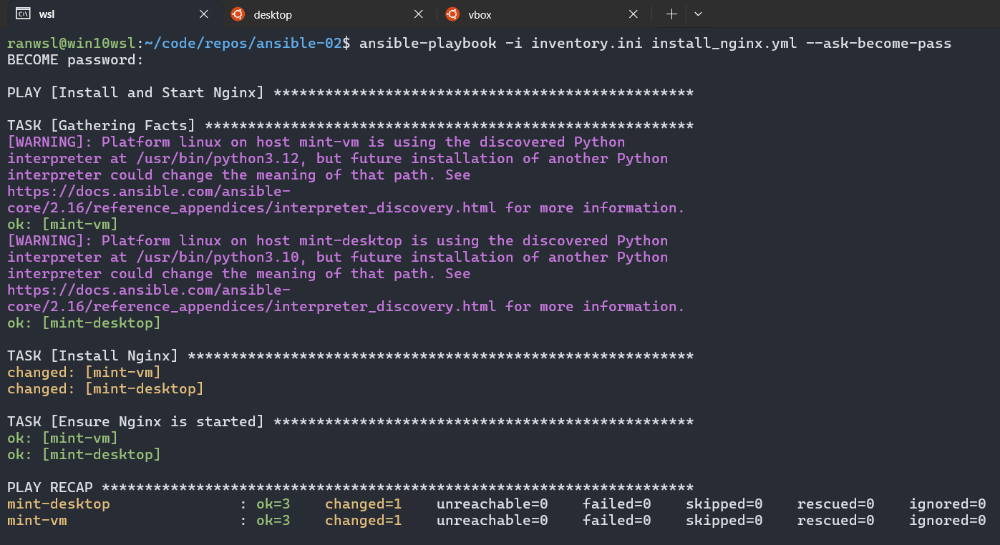

# ansible-02

## Playbooks & Package Management

## Overview

This project demonstrates how to use Ansible playbooks to install and manage packages. We will install and configure Nginx on our Linux Mint machines.

## Prerequisites

- Ansible installed on WSL (Control Node)
- SSH key-based authentication set up between the control node and managed nodes
- Sudo privileges on the managed nodes

## Inventory Configuration

Ensure your `inventory.ini` file is set up correctly:

```ini
[linux_mint]
mint-desktop ansible_host=<desktop-ip> ansible_user=<user>
mint-vm ansible_host=<vm-ip> ansible_user=<user>
```

## Writing the Ansible Playbook

Create a file named `install_nginx.yml` with the following content:

```yaml
- name: Install and Start Nginx
  hosts: linux_mint
  become: true
  tasks:
    - name: Install Nginx
      apt:
        name: nginx
        state: present

    - name: Ensure Nginx is started
      service:
        name: nginx
        state: started
        enabled: true
```

### Explanation

1. The playbook targets the `linux_mint` group.
2. `become: true` ensures the tasks run with sudo privileges.
3. The first task installs Nginx.
4. The second task ensures Nginx is running and enabled on boot.

## Running the Playbook

Execute the following command:

```bash
ansible-playbook -i inventory.ini install_nginx.yml --ask-become-pass
```



## Verification

1.Check if Nginx is running:

```bash
ansible linux_mint -i inventory.ini -m shell -a "systemctl status nginx"
```

2.Open a browser and visit `http://<Linux_Mint_IP>` to confirm the Nginx page is displayed.
